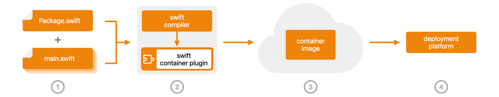

# Swift Container Plugin

[](https://swiftpackageindex.com/apple/swift-container-plugin/documentation)
[](https://github.com/apple/swift-container-plugin/releases)
[](https://swiftpackageindex.com/apple/swift-container-plugin)
[](https://swiftpackageindex.com/apple/swift-container-plugin)
[](https://github.com/apple/swift-container-plugin/actions/workflows/main.yml)

Build and publish container images using Swift Package Manager.

## Overview

Container images are the standard way to package cloud software today.   Once you have packaged your server in a container image, you can deploy it on any container-based public or private cloud service, or run it locally using a desktop container runtime.

Use Swift Container Plugin to build and publish container images for your Swift services in one streamlined workflow with Swift Package Manager.

[](https://swiftpackageindex.com/apple/swift-container-plugin/documentation)

1. [Add the plugin to your project's dependencies](https://swiftpackageindex.com/apple/swift-container-plugin/documentation/swift-container-plugin/adding-the-plugin-to-your-project) in `Package.swift`.
2. [Build and package your service](https://swiftpackageindex.com/apple/swift-container-plugin/documentation/swift-container-plugin/build) using Swift Package Manager.
   - If you are building on macOS, [use a Swift SDK](https://swiftpackageindex.com/apple/swift-container-plugin/documentation/swift-container-plugin/requirements) to cross-compile a Linux executable.
   - If you are building on Linux, use your native Swift compiler to build a Linux executable.   If you have special requirements such as building a static executable, or cross-compiling to a different processor architecture, use a suitable Swift SDK.
3. The plugin automatically packages your executable in a container image and publishes it to your chosen container registry.
4. [Run your container image](https://swiftpackageindex.com/apple/swift-container-plugin/documentation/swift-container-plugin/run) on any container-based platform.

Find full details [in the documentation](https://swiftpackageindex.com/apple/swift-container-plugin/documentation).

## Usage

Swift Container Plugin can package any executable product defined in `Package.swift` in a container image and publish it to a container registry.

### Build and publish a container image

After adding the plugin to your project, you can build and publish a container image in one step.
Here is how to build the [HelloWorld example](https://github.com/apple/swift-container-plugin/tree/main/Examples/HelloWorldHummingbird) as a static executable for Linux running on the `x86_64` architecture:

```
% swift package --swift-sdk x86_64-swift-linux-musl \
        build-container-image --repository registry.example.com/myservice
...
Plugin ‘ContainerImageBuilder’ wants permission to allow all network connections on all ports.
Stated reason: “This command publishes images to container registries over the network”.
Allow this plugin to allow all network connections on all ports? (yes/no) yes
...
Building for debugging...
Build of product 'containertool' complete! (4.95s)
...
Build of product 'hello-world' complete! (5.51s)
...
[ContainerImageBuilder] Found base image manifest: sha256:7bd643386c6e65cbf52f6e2c480b7a76bce8102b562d33ad2aff7c81b7169a42
[ContainerImageBuilder] Found base image configuration: sha256:b904a448fde1f8088913d7ad5121c59645b422e6f94c13d922107f027fb7a5b4
[ContainerImageBuilder] Built application layer
[ContainerImageBuilder] Uploading application layer
[ContainerImageBuilder] Layer sha256:dafa2b0c44d2cfb0be6721f079092ddf15dc8bc537fb07fe7c3264c15cb2e8e6: already exists
[ContainerImageBuilder] Layer sha256:2565d8e736345fc7ba44f9b3900c5c20eda761eee01e01841ac7b494f9db5cf6: already exists
[ContainerImageBuilder] Layer sha256:2c179bb2e4fe6a3b8445fbeb0ce5351cf24817cb0b068c75a219b12434c54a58: already exists
registry.example.com/myservice@sha256:a3f75d0932d052dd9d448a1c9040b16f9f2c2ed9190317147dee95a218faf1df
```

### Run the image

Deploy your service in the cloud, or use a standards-compliant container runtime to run it locally:

```
% podman run -p 8080:8080 registry.example.com/myservice@sha256:a3f75d0932d052dd9d448a1c9040b16f9f2c2ed9190317147dee95a218faf1df
Trying to pull registry.example.com/myservice@sha256:a3f75d0932d052dd9d448a1c9040b16f9f2c2ed9190317147dee95a218faf1df...
...
2024-05-26T22:57:50+0000 info HummingBird : [HummingbirdCore] Server started and listening on 0.0.0.0:8080
```

## Platforms and requirements

* Swift Container Plugin runs on macOS and Linux and requires Swift 6.0 or later.
* On macOS you must install a cross-compilation Swift SDK, such as the [Swift Static Linux SDK](https://www.swift.org/documentation/articles/static-linux-getting-started.html), in order to build executables which can run on Linux-based cloud infrastructure.
* A container runtime is not required to build an image, but one must be available wherever the image is to be run.

### Find out more
* Learn more about setting up your project in the [plugin documentation](https://swiftpackageindex.com/apple/swift-container-plugin/documentation/swift-container-plugin).

* Take a look at [more examples](https://github.com/apple/swift-container-plugin/tree/main/Examples).

* Watch some talks:

    * [How to put Swift in a box](https://www.youtube.com/watch?v=MV0wACpikyw) at [Open Source Summit North America 2025](https://events.linuxfoundation.org/archive/2025/open-source-summit-north-america/).
    * [How to put Swift in a box](https://fosdem.org/2025/schedule/event/fosdem-2025-5116-how-to-put-swift-in-a-box-building-container-images-with-swift-container-plugin/) at [FOSDEM 2025](https://fosdem.org/2025/schedule/track/swift/).
    * [Swift to the cloud in a single step](https://www.youtube.com/watch?v=9AaINsCfZzw) at [ServerSide.Swift 2024](https://www.serversideswift.info/2024/speakers/euan-harris/).
